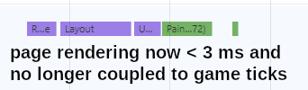
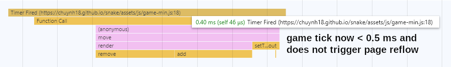

[Snake](https://chuynh18.github.io/snake/)
=====

This is a game that has been implemented and reimplemented who knows how many times.  Now it's my turn.

Click start, then use the arrow keys (on the keyboard) to move.  On a mobile device?  There (should be) virtual "buttons" for you to use.  That being said, I only have a Nexus 6P and Nexus 7 to test against.  Got a larger tablet or a smaller phone?  Let me know if something's amiss.

When you collect the fruit, your snake grows by one segment, and also slithers more quickly.

I wrote this mainly because I wanted to make a "real-time" game.  Turns out it was considerably easier than [Tic-tac-toe](https://github.com/chuynh18/tictactoe/) and [Four-in-a-row](https://github.com/chuynh18/fourinarow/).

Note that `style-min.css` and `game-min.js` are obviously minified, but `index.html` is also minified.  See `index-full.html` for the original file.

`index-full.html` + `style.css` + `game.js` together are 76.1 KB (non-gzipped).
`index.html` + `style-min.css` + `game-min.js` together are 48.1 KB (also non-gzipped).

Optimization
------------

Originally, I did a poor job of adding CSS animations in.  All the top search engine results for "replay CSS animation" led to hacks that caused the page to reflow, which I already knew was nowhere near ideal.  However, it's a solution that in most cases would lead to imperceptible performance penalties.  Unfortunately, that's not true for me, as Snake is a real time game.

I was removing and adding the animation class to each snake segment as the snake moved along.  On my laptop running Chrome, this was approximately a half millisecond penalty per page reflow.  In other words, I was paying a linear time penalty (0.5 ms * `snake.length`), in addition to the cost of the game logic.  On lower-powered mobile devices, this is even worse; on my phone, it resulted in the performance noticeably suffering when `snake.length > 8`.

While the work is incomplete, I've refactored the code to apply the animation to the snake's body only once, but to repeat it `snake.length` number of times.  Further refactoring will be required to eliminate the flickering.  That being said, I'm already reaping the performance improvements.  On my laptop, page redraws are now less frequent and no longer tied to game ticks.  Page redraws take less than 3 ms, and game logic now takes less than half a millisecond!

Page redraws are now less than 3 ms:

Game ticks are less than half a millisecond:

